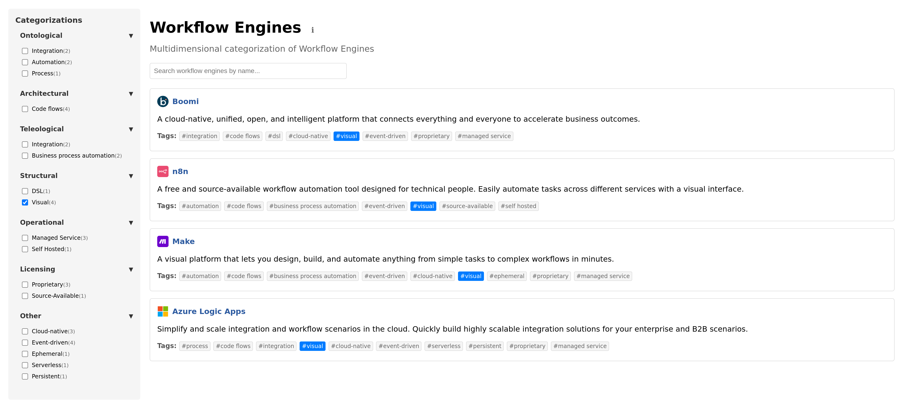

# Workflow Engines Explorer

[](https://iocanel.com/workflow-engines)

*To use the live application go to: https://iocanel.com/workflow-engines/*

**Multidimensional categorization of Workflow Engines**

A faceted search tool for exploring workflow engines across philosophical and technical dimensions. 
Traditional attempts like *awesome-workflow-engines* that present engines in simple lists make it hard to explore multiple aspects of the engines. 
This project provides a multidimensional representation to help you discover engines that match your specific needs.

## Features

- **Faceted Search**: Filter engines by multiple dimensions simultaneously
- **Real-time Search**: Search engines by name with instant results
- **Multidimensional Categories**: Explore engines across 6 philosophical dimensions
- **Interactive Tags**: Click any tag to filter results
- **Responsive Design**: Works on desktop and mobile devices

## Categories

The tool categorizes workflow engines across these dimensions:

- **Ontological**: What kind of thing is the engine managing?
- **Architectural**: What are the core architectural elements?
- **Teleological**: What is the primary purpose and goals?
- **Structural**: What's the structure/format of workflows?
- **Operational**: How is the engine deployed and operated?
- **Licensing**: What is the licensing model?
- **Other**: Additional traits and characteristics

## Included Engines

The explorer currently includes 20+ workflow engines:

- **Orchestration**: Temporal, Camunda (Zeebe), AWS Step Functions
- **Data Pipelines**: Airflow, Dagster, Prefect, Luigi, Kestra
- **CI/CD**: Argo Workflows, Tekton
- **BPM**: Flowable, Activiti, jBPM
- **Integration**: Apache Camel, Boomi
- **Automation**: n8n, Make, Zapier
- **Cloud Services**: Azure Logic Apps, Google Cloud Workflows
- **ML/AI**: Kubeflow Pipelines

## Getting Started

### Prerequisites

- A modern web browser

### Running Locally

1. Clone the repository:
```bash
git clone https://github.com/iocanel/workflow-engines.git
cd workflow-engines
```

2. Open the index.html file in your browser, or run a local HTTP server. For example, using Python's built-in server:
```bash
python3 -m http.server 8000
```

3. Open your browser and navigate to:
```
http://localhost:8000
```

**Note**: The application cannot be opened directly as a `file://` URL due to CORS policy restrictions with the FacetView library. A local HTTP server is required.

## Architecture

This is a single-page application built with:

- **HTML/CSS/JavaScript**: Core application structure and styling
- **jQuery**: DOM manipulation and event handling
- **Embedded Data**: Workflow engine data stored as JavaScript arrays
- **Faceted Search**: Custom implementation for filtering and categorization

The entire application is contained in a single `index.html` file with embedded:
- Workflow engine data
- Faceted search logic
- Responsive CSS styling
- Interactive JavaScript functionality

## Contributing

Community collaboration is essential to keep this up to date. You can contribute by:

- 📋 [Reporting issues](https://github.com/iocanel/workflow-engines/issues) for new engines, corrections, or improvements
- 🚀 Adding new workflow engines with proper categorization
- 🏷️ Updating existing engine information
- 📂 Proposing new category dimensions

For detailed contribution guidelines, please see [CONTRIBUTING.md](CONTRIBUTING.md).

## License

This project is licensed under the Apache License 2.0 - see the [LICENSE](LICENSE) file for details.

## Acknowledgments

- Inspired by [awesome-workflow-engines](https://github.com/meirwah/awesome-workflow-engines)
